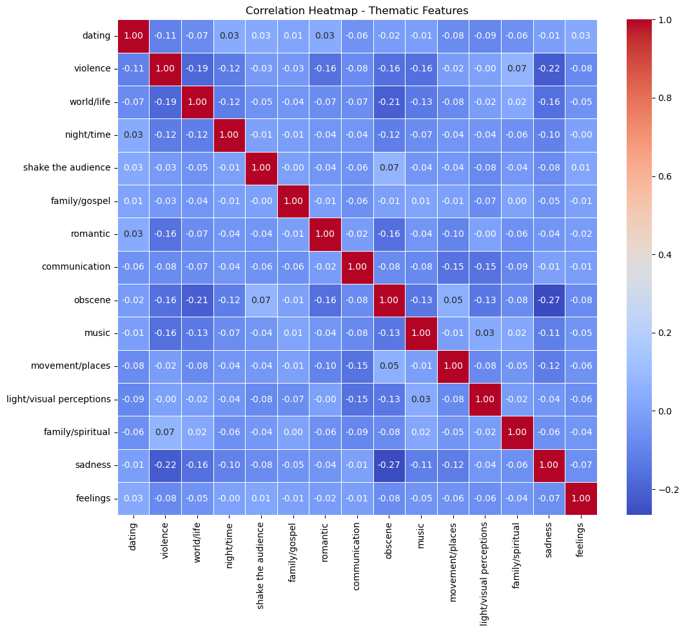
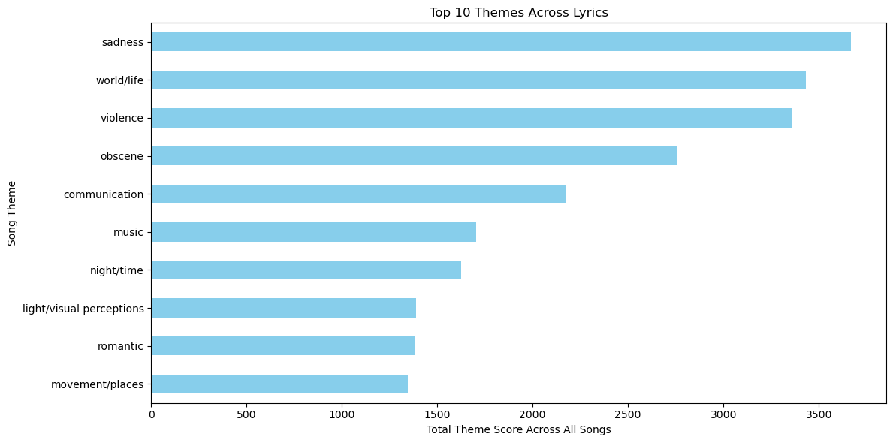

# TLAB Music
# Unsupervised Music Recommendation Algorithm 🎶

This repository is dedicated to building a recommendation system that suggests new songs to users based on their listening history. This project is part of an initiative at our music platform start-up, which recently secured Series B financing.

## Project Overview

The goal of this project is to develop an unsupervised learning algorithm using sklearn to cluster unlabeled music data. These clusters will serve as the foundation for recommending music to users. The project will be built from scratch and will include the following steps:

1. **Initial EDA**: Explore the dataset to understand its structure and key characteristics
2. **Data Preprocessing & Dimensionality Reduction**: Clean the data and reduce its dimensionality for efficient modeling
3. **Unsupervised Modeling & Tuning**: Train and fine-tune clustering algorithms to generate meaningful clusters
4. **Report**: Summarize findings and results.
5. **(Optional Bonus Challenge)**: Perform Word2Vec analysis for deeper insights

## Dataset

[Music Dataset](https://drive.google.com/file/d/1oGoUawIeH--KED4sB2MFyzBq90GppNnG/view?usp=sharing).

### Correlation Heat Map based on Thematic Colunns 
- The current data does not show any strong correkations between any song themes, positie or negative relarionshop. 

### Top Song Genres 

---
🎶

